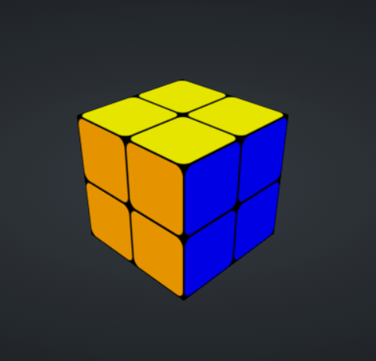
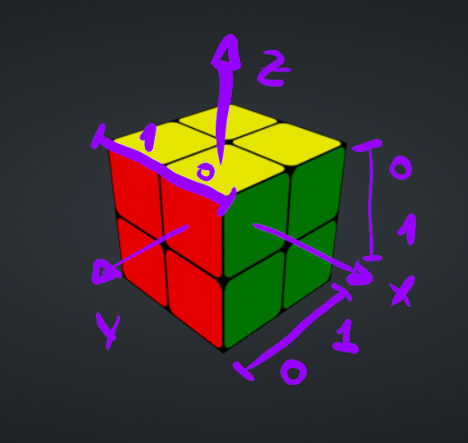
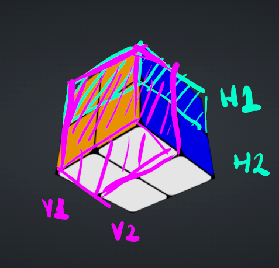
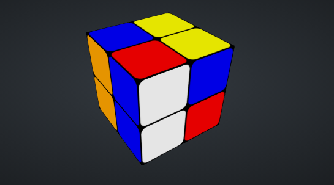
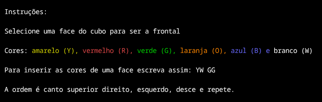
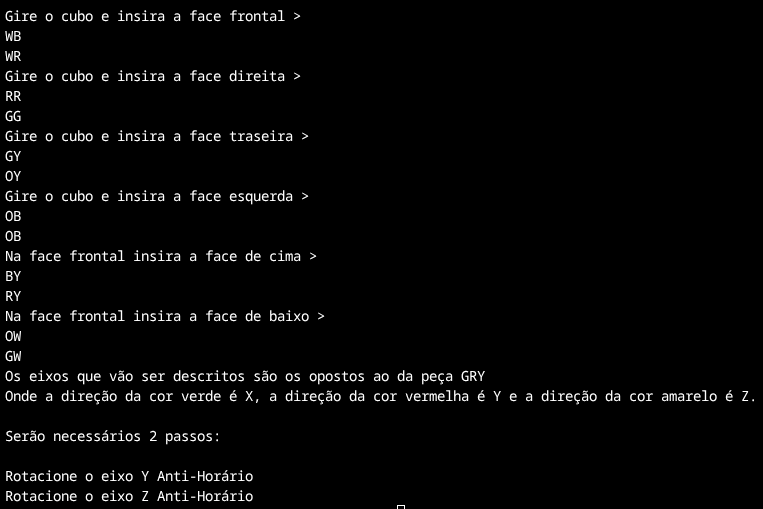
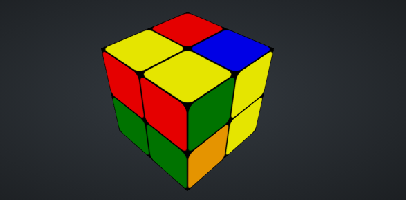
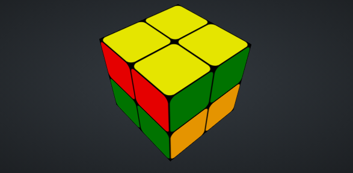
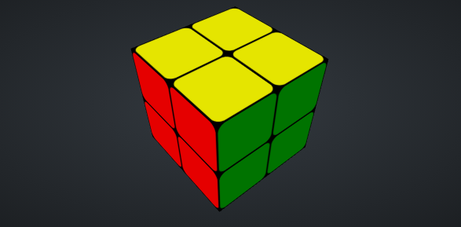

# G33_Grafos_PA-26.1

# Cubando

*Conteúdo da Disciplina*: Grafos<br>

## Alunos
|Matrícula | Aluno |
| -- | -- |
| 23/2014404  |  [Carlos Henrique Brasil de Souza](https://github.com/Carlos-UCH) |
| 23/2014576  |  [Yogi Nam de Souza Barbosa](https://github.com/oyogi)


## Sobre
Projeto desenvolvido por alunos da Universidade de Brasília(UnB) para a disciplina de Projeto de Algoritmos. 

O projeto consiste na resolução de um cubo mágico. Como o cubo possui diversas combinações possíveis, neste projeto o foco será em um cubo 2x2x2. 
Será utilizado um algoritmo de busca em largura(BFS), que percorrerá um grafo para encontrar a menor quantidade de movimentos necessários para a montagem.


## Screenshots

Cubo do cube solve 2x2x2:



Referencial:




Camadas:




## Instalação 
*Linguagem*: C++<br>

## Clone o repositório  
 ```sh 
    git clone git@github.com:projeto-de-algoritmos-2026/G33_Grafos_PA-26.1.git
    cd G33_Grafos_PA-26.1
 ```

### Pre-requisitos
- Ter o C++20 instalado.
- Acesso ao [cube solver](https://cube-solver.com/#id=2)


## Uso
Rode no terminal: 
```sh 
    g++ -O2 -std=c++20 -Idbg solve_cube.cpp read_cube.cpp utils.cpp -o cubando
    $./cubando
```
Embaralhe o cubo no cube solver.







Sincronize com a peça fixada(GRY) e mova de acordo com as orientações dadas. 

Ex: 



Passo 1(de acordo com as orientações):



Passo 2(de acordo com as orientações):

