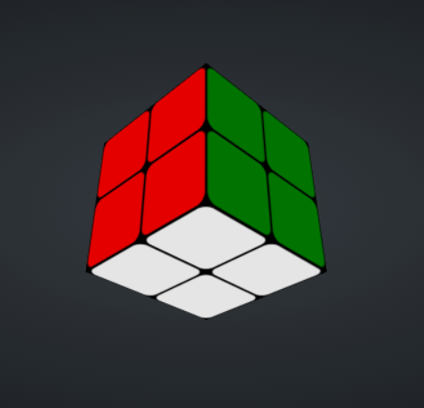
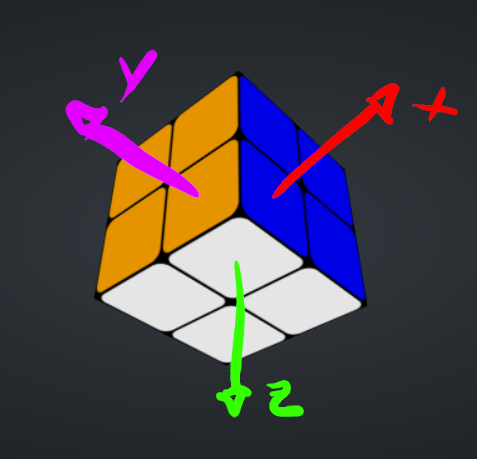
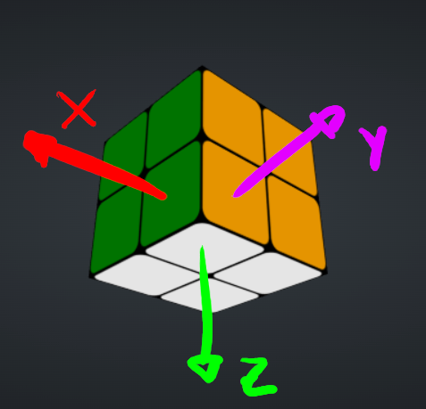

## Como representar um cubo mágico em código?

Primeiro vamos considerar que podemos representar qualquer estado de cubo mágico, incluindo os impossíveis, tipo se ele caiu e desmontou. Então, basta tentar representar pelas peças, o cubo mágico 2x2x2 tem 8 peças e elas são todas distintas, então podemos fazer um mapeamento tipo:

(Considere um cubo com as cores amarelo (Y), vermelho (R), verde (G), laranja (O), azul (B) e branco (W))

Imagens de cubo mágico tiradas pelo site [cube-solver.com](https://cube-solver.com).

Vou colocar a letra de cada cor da peça na ordem alfabética e mapear a um número.

| Peça | Número |
| ---- | ------ |
| BOW  | 1      |
| BOY  | 2      |
| BRW  | 3      |
| BRY  | 4      |
| GOW  | 5      |
| GOY  | 6      |
| GRW  | 7      |
| GRY  | 8      |

Agora, cada peça pode estar em 3 eixos, então vamos definir o eixo da primeira peça como referência:

BOW: a direção que a parte azul está vai ser chamada de X, a laranja e Y e a branca de Z.

Daí os eixos das peças vai ser conforme a direção que a cor da primeira letra está orientada:

Imagens de cubo mágico tiradas pelo site [cube-solver.com](https://cube-solver.com) e desenhadas pelo software GIMP.

| Peça | Eixo |
| ---- | ---- |
| BOW  | X    |
| BOY  | X    |
| BRW  | X    |
| BRY  | X    |
| GOW  | X    |
| GOY  | X    |
| GRW  | X    |
| GRY  | X    |

Beleza, conseguimos representar as peças, mas ainda há ambiguidade, não sabemos exatamente onde cada peça está no cubo.

Então, vamos adicionar mais umas posições relativas, tendo a primeira peça como referência, existem 2 camadas horizontais e 2 camadas verticais.

Imagem de cubo mágico tiradas pelo site [cube-solver.com](https://cube-solver.com) e desenhada pelo software GIMP.

Vamos definir por um par ordenado em quais camadas cada peça está:

| Peça | Camadas |
| ---- | ------- |
| BOW  | H2 V1   |
| BOY  | H1 V1   |
| BRW  | H2 V2   |
| BRY  | H1 V2   |
| GOW  | H2 V1   |
| GOY  | H1 V1   |
| GRW  | H2 V2   |
| GRY  | H1 V2   |

Agora sim, conseguimos representar completamente o cubo mágico.

Para ter eficiência faremos uma máscara de bits, cada peça precisa de 2 bits para representar a orientação e 2 bits para representar as camadas, então 4 bits por peça, como temos 8 peças para representar um estado do cubo mágico gastamos 32 bits, que cabe num `int` do C/C++.

Mas, desse jeito não daria para indexar os índices num vetor, porque ele teria que ter 4 bilhões de posições, o que faria com que precisássemos de outra estrutura adicionando um `log` na complexidade.

Fixando a peça inicial então precisamos só guardar informações sobre 7 peças, então 28 bits, mas ainda não tá bom.

O mínimo possível de estados provavelmente é `7! * 3^4 = 11.022.480`, pois fixado uma peça tem 7 posições livres para as outras e cada uma tem 3 eixos. Mas, se só representarmos pelo número da permutação como as transições do grafo vão funcionar?

CUBOVELOCIDADE. Movimentos Básicos. CuboVelocidade. Disponível em: https://cubovelocidade.com.br/tutorial/cubo-magico-3x3x3-movimentos-basicos/. Acesso em: 12 abr. 2026.

CUBOVELOCIDADE. Casos Impossíveis. CuboVelocidade. Disponível em: https://cubovelocidade.com.br/tutorial/cubo-magico-3x3x3-casos-impossiveis/. Acesso em: 12 abr. 2026.